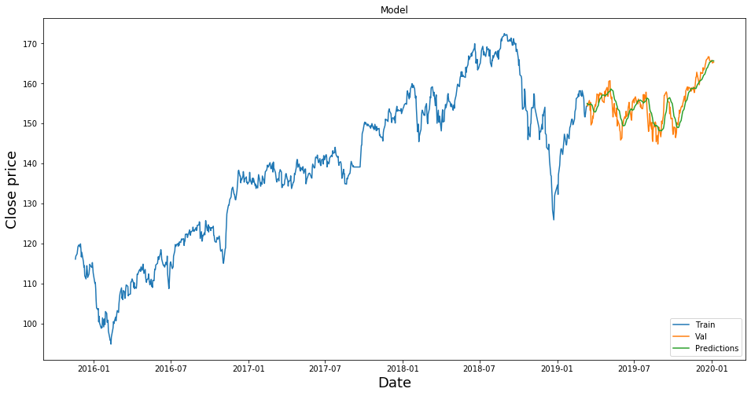

```python
import math
import numpy as np
import pandas as pd
import seaborn as sns

import matplotlib.pyplot as plt

from sklearn.preprocessing import MinMaxScaler
from sklearn.model_selection import train_test_split
from keras.models import Sequential
from keras.layers import Dense, LSTM
```

    Using TensorFlow backend.
    /Users/Raphael/anaconda3/envs/ada/lib/python3.7/site-packages/tensorflow/python/framework/dtypes.py:526: FutureWarning: Passing (type, 1) or '1type' as a synonym of type is deprecated; in a future version of numpy, it will be understood as (type, (1,)) / '(1,)type'.
      _np_qint8 = np.dtype([("qint8", np.int8, 1)])
    /Users/Raphael/anaconda3/envs/ada/lib/python3.7/site-packages/tensorflow/python/framework/dtypes.py:527: FutureWarning: Passing (type, 1) or '1type' as a synonym of type is deprecated; in a future version of numpy, it will be understood as (type, (1,)) / '(1,)type'.
      _np_quint8 = np.dtype([("quint8", np.uint8, 1)])
    /Users/Raphael/anaconda3/envs/ada/lib/python3.7/site-packages/tensorflow/python/framework/dtypes.py:528: FutureWarning: Passing (type, 1) or '1type' as a synonym of type is deprecated; in a future version of numpy, it will be understood as (type, (1,)) / '(1,)type'.
      _np_qint16 = np.dtype([("qint16", np.int16, 1)])
    /Users/Raphael/anaconda3/envs/ada/lib/python3.7/site-packages/tensorflow/python/framework/dtypes.py:529: FutureWarning: Passing (type, 1) or '1type' as a synonym of type is deprecated; in a future version of numpy, it will be understood as (type, (1,)) / '(1,)type'.
      _np_quint16 = np.dtype([("quint16", np.uint16, 1)])
    /Users/Raphael/anaconda3/envs/ada/lib/python3.7/site-packages/tensorflow/python/framework/dtypes.py:530: FutureWarning: Passing (type, 1) or '1type' as a synonym of type is deprecated; in a future version of numpy, it will be understood as (type, (1,)) / '(1,)type'.
      _np_qint32 = np.dtype([("qint32", np.int32, 1)])
    /Users/Raphael/anaconda3/envs/ada/lib/python3.7/site-packages/tensorflow/python/framework/dtypes.py:535: FutureWarning: Passing (type, 1) or '1type' as a synonym of type is deprecated; in a future version of numpy, it will be understood as (type, (1,)) / '(1,)type'.
      np_resource = np.dtype([("resource", np.ubyte, 1)])


```python
df = pd.read_excel('Sample Dataset.xlsx')
df['Date'] = pd.to_datetime(df['Date'], infer_datetime_format=True)
df = df.set_index(['Date'])
```

# Part 1

### Review the quality of the data, list any potential errors, and propose corrected values. Please list each quality check error and correction applied.


```python
df.head()
```


<div>
<style scoped>
    .dataframe tbody tr th:only-of-type {
        vertical-align: middle;
    }

    .dataframe tbody tr th {
        vertical-align: top;
    }

    .dataframe thead th {
        text-align: right;
    }
</style>
<table border="1" class="dataframe">
  <thead>
    <tr style="text-align: right;">
      <th></th>
      <th>Signal</th>
      <th>Open</th>
      <th>High</th>
      <th>Low</th>
      <th>Close</th>
      <th>Adj Close</th>
    </tr>
    <tr>
      <th>Date</th>
      <th></th>
      <th></th>
      <th></th>
      <th></th>
      <th></th>
      <th></th>
    </tr>
  </thead>
  <tbody>
    <tr>
      <th>2015-11-19</th>
      <td>13.768540</td>
      <td>116.440002</td>
      <td>116.650002</td>
      <td>115.739998</td>
      <td>116.059998</td>
      <td>108.281601</td>
    </tr>
    <tr>
      <th>2015-11-20</th>
      <td>13.608819</td>
      <td>116.480003</td>
      <td>117.360001</td>
      <td>116.379997</td>
      <td>116.809998</td>
      <td>108.981323</td>
    </tr>
    <tr>
      <th>2015-11-23</th>
      <td>12.990589</td>
      <td>116.709999</td>
      <td>117.889999</td>
      <td>116.680000</td>
      <td>117.389999</td>
      <td>109.522453</td>
    </tr>
    <tr>
      <th>2015-11-24</th>
      <td>12.667435</td>
      <td>116.879997</td>
      <td>118.419998</td>
      <td>116.559998</td>
      <td>118.250000</td>
      <td>110.324837</td>
    </tr>
    <tr>
      <th>2015-11-25</th>
      <td>13.019910</td>
      <td>118.300003</td>
      <td>119.320000</td>
      <td>118.110001</td>
      <td>119.169998</td>
      <td>111.183159</td>
    </tr>
  </tbody>
</table>
</div>


```python
# Print Open price for ETF
plt.figure(figsize=(16, 8))
plt.title("Open price for an ETF")
plt.xlabel("Date")
plt.ylabel("Open price")
df['Open'].plot()
plt.show()
```


    

    


```python
# Print all the ETF values
plt.figure(figsize=(16, 8))
df['Open'].plot(label='ETF Open price')
df['Close'].plot(label='ETF Close price')
df['High'].plot(label='ETF High price')
df['Low'].plot(label='ETF Low price')
plt.legend()
plt.title("ETF Stock prices")
plt.ylabel("Stock price")
plt.xlabel("Date")
plt.show()
```


    

    


As we can see, all of the stock prices are coherent exept for a date between 2018-01 and 2018-07. Let's find this anomaly.


```python
# There is an anomaly in the close price. Let's show the date
df['Close'].max()
mask = df['Close'] > df['Open'].max()
df.loc[mask]
```


<div>
<style scoped>
    .dataframe tbody tr th:only-of-type {
        vertical-align: middle;
    }

    .dataframe tbody tr th {
        vertical-align: top;
    }

    .dataframe thead th {
        text-align: right;
    }
</style>
<table border="1" class="dataframe">
  <thead>
    <tr style="text-align: right;">
      <th></th>
      <th>Signal</th>
      <th>Open</th>
      <th>High</th>
      <th>Low</th>
      <th>Close</th>
      <th>Adj Close</th>
    </tr>
    <tr>
      <th>Date</th>
      <th></th>
      <th></th>
      <th></th>
      <th></th>
      <th></th>
      <th></th>
    </tr>
  </thead>
  <tbody>
    <tr>
      <th>2018-03-19</th>
      <td>18.660897</td>
      <td>157.169998</td>
      <td>157.210007</td>
      <td>154.449997</td>
      <td>196.279999</td>
      <td>150.708221</td>
    </tr>
  </tbody>
</table>
</div>


Here we see that the Close price is way above the High value of that specific date. We could interpolate the Close data with statistical methods but a good approximation that should not modify the information a lot would be to replace the Close value by the Low value. Let's do this:


```python
df.replace(df['Close'].max(), df.loc[mask]['Low'].values[0], inplace=True)
```

# Part 2.

###  Please analyze the signal’s effectiveness or lack thereof in forecasting ETF price, using whatever metrics you think are most relevant.

As a metric to see if the signal is efficient in forecasting ETF price, we use two types of correlation. In the broadest sense correlation is any statistical association. Correlations are useful because they can indicate a predictive relationship that can be exploited in practice. Here we simply use the pandas provided correlations.

#### Pearson

Pearson correlation coefficient is a measure of linear correlation between two sets of data.


```python
df.Signal.corr(df.Close), df.Signal.corr(df.Open)
```


    (0.8037466266299015, 0.8022463833257815)


Here we see that there is clearly a linear correlation which means that a linear model could relatively well predict the ETF price. This is explainable by the first ascendant part of the stock that shows a visible linear behavour.

#### Spearman

Spearman's rank correlation coefficient is a nonparametric measure of rank correlation. It assesses how well the relationship between two variables can be described using a monotonic function.


```python
df.Signal.corr(df.Close, method='spearman'), df.Signal.corr(df.Open, method='spearman')
```


    (0.9005766711962664, 0.8977264232782438)


We see that both prices are higlhy correlated in terms of Spearman's rank. This comes to confirm the Pearson correlation and emphase the ability of the signal to predict ETF prices.

### Conclusion

The high correlation values for both Pearson and Spearman method suggest of good prediction capability for the Signal feature.

# Part3.

###  (Extra credit) Write a 1-2 paragraph summary for the Portfolio Manager addressing your observations about the efficacy and believability of the product, and recommendation for next steps.

To define if it is a good idea to invest in the product, let's work a little bit on the data to see if we can extract some relevant informations.

### Smoothing by Moving Average

As we see in previous graphs, the stock price is quite noisy which makes difficult to see trends in it. To smooth a little bit the time series and output tendancies, we're going to use moving average method first of all.


```python
# Let's create moving average column
df['MA50'] = df['Open'].rolling(50).mean()
plt.figure(figsize=(16, 8))
plt.title("Moving average over 50 days for Open prices")
df['MA50'].plot()
plt.ylabel("Smoothed price over 50 days")
plt.show()
```


    

    


The moving average method shows a clear tendancy for the stock to rise over the four years. At the end of the year 2019 there is a drop which is a catch up for a long period of time with almost linear increase (this is assessed by Pearson coefficients above). After the drop, the product quickly start back its rise with a slower slope. This can be interpreted as a good sign for the futur of this product.

### Volatility

A good indicator to keep investing in this product is the volatility. This indicator gives informations regarding the stability of the product. To invest in this product, especially for long term investment, we want stability. So let's look at it:


```python
# Let's create a column with `Daily Percentage Return`
df['Returns'] = (df['Close'] / df['Close'].shift(1)) - 1
```


```python
# Let's plot the Returns histogram
plt.figure(figsize=(5, 5))
plt.title("Daily Percentage Return Histogram")
df['Returns'].hist(bins=50)
plt.xlabel("Daily Percentage Return")
plt.show()
```


    

    


Here we see that the overall volatitly is interesting since the standard deviation is small. But recalling the previous trend with the break out end of year 2019, it is interesting to compare volatility before and after this event to see if the regime changed (reflecting bad company or fund performance). To do so, we study the evolution of the volatility from the beginning until 2017-04-1, then from 2017-04-1 until 2018-08-1 and eventually from 2018-08-1 until the end.


```python
# Let's create three different dataframes for the three periods of time
mask1 = df.index <= pd.to_datetime('2017-04-1')
mask2 = (df.index > pd.to_datetime('2017-04-1')) & (df.index < pd.to_datetime('2018-08-1'))
mask3 = df.index >= pd.to_datetime("2018-08-1")

early = df.loc[mask1]
mid = df.loc[mask2]
late = df.loc[mask3]
```


```python
# Plot raw volatility for the three periods of time
plt.figure(figsize=(8, 6))
early['Returns'].hist(bins=100, label='Early', alpha=0.5)
mid['Returns'].hist(bins=100, label='Mid', alpha=0.5)
late['Returns'].hist(bins=100, label='Late', alpha=0.5)
plt.legend()
plt.title("Evolution of the Volatility through 3 time periods")
plt.show()
```


    

    


```python
# Let's use kernel density estimations normalized to assess if there is a difference or not through time
plt.figure(figsize=(8, 6))
early['Returns'].plot(kind='kde', label='Early', alpha=0.5)
mid['Returns'].plot(kind='kde', label='Mid', alpha=0.5)
late['Returns'].plot(kind='kde', label='Late', alpha=0.5)
plt.legend()
plt.title("Evolution of the Volatility through 3 time periods with Kernel Density Estimation")
plt.xlabel("Normalized Volatility")
plt.show()
```


    

    


As we can see, the volatility is seemingly constant over time which is a good sign. This means that the stock product is really stable in the long run. This can be interpreted as a good performance from the company that provide the asset. 

### Conclusion

Regarding the fact that with moving average method we can clearly see the product's trend to be rising in the long run and then that the volatility is almost constant over time, we conclude that the product is a good investment, especially for long term investment. Of course this analysis is way to simple to give any advice on short term investment.

## B. Next steps: Create a model to predict the data prices

Here we create a simple LSTM neural network to model the data and try to predict ETF price for 1 month (30 days) prediction.


```python
# Keep only close values
data = df.filter(['Close'])
dataset = data.values
# Get the number of data to train the model
training_data_len = math.ceil(len(dataset) * .8)
```


```python
# Scale the data
scaler = MinMaxScaler(feature_range=(0, 1))
scaled_data = scaler.fit_transform(dataset)
```


```python
# Create the training dataset
train_data = scaled_data[0:training_data_len, :]
# Split the data into x_train / y_train data sets
features_number = 30
x_train = []
y_train = []

for i in range(features_number, len(train_data)):
    x_train.append(train_data[i-features_number:i, 0])
    y_train.append(train_data[i, 0])
    if i <= features_number:
        print(x_train)
        print(y_train)
        print()

```

    [array([0.27370991, 0.28336118, 0.29082484, 0.30189164, 0.3137305 ,
           0.31952133, 0.31282972, 0.32299573, 0.30639554, 0.28065882,
           0.2958435 , 0.27306655, 0.26483081, 0.24823062, 0.25312055,
           0.22030631, 0.21001158, 0.23060093, 0.25273452, 0.23703511,
           0.2147729 , 0.22558228, 0.23883667, 0.25723843, 0.2536353 ,
           0.24681508, 0.26264311, 0.24771587, 0.22944283, 0.1958564 ])]
    [0.19894478444144625]
    


```python
# Convert to numpy arrays
x_train, y_train = np.array(x_train), np.array(y_train)
```


```python
# Reshape the data
x_train = np.reshape(x_train, (x_train.shape[0], x_train.shape[1], 1))
x_train.shape
```


    (801, 30, 1)


```python
# Build LSTM model
model = Sequential()
model.add(LSTM(50, return_sequences=True, input_shape=(x_train.shape[1], 1)))
model.add(LSTM(50, return_sequences=False))
model.add(Dense(25))
model.add(Dense(1))
```

    WARNING:tensorflow:From /Users/Raphael/anaconda3/envs/ada/lib/python3.7/site-packages/tensorflow/python/ops/resource_variable_ops.py:435: colocate_with (from tensorflow.python.framework.ops) is deprecated and will be removed in a future version.
    Instructions for updating:
    Colocations handled automatically by placer.


```python
# Compile the model
model.compile(
    optimizer='adam',
    loss='mean_squared_error'
)
```


```python
# Train the model
model.fit(x_train, y_train, batch_size=1, epochs=1)
```

    WARNING:tensorflow:From /Users/Raphael/anaconda3/envs/ada/lib/python3.7/site-packages/tensorflow/python/ops/math_ops.py:3066: to_int32 (from tensorflow.python.ops.math_ops) is deprecated and will be removed in a future version.
    Instructions for updating:
    Use tf.cast instead.
    Epoch 1/1
    801/801 [==============================] - 34s 43ms/step - loss: 0.0063


    <keras.callbacks.callbacks.History at 0x1378d3710>


```python
# Create the test dataset
# Create new arrays containing scaled values
test_data = scaled_data[training_data_len-features_number:, :]
# Create x and y test
x_test = []
y_test = dataset[training_data_len:, :]

for i in range(features_number, len(test_data)):
    x_test.append(test_data[i-features_number:i, 0])
```


```python
# COnvert the data to a numpy array
x_test = np.array(x_test)
```


```python
# Reshape the data
x_test = np.reshape(x_test, (x_test.shape[0], x_test.shape[1], 1))
```


```python
# Get the model predictions
predictions = model.predict(x_test)
predictions = scaler.inverse_transform(predictions)
```


```python
# Get the root mean squared error (RMSE)
rmse = np.sqrt(np.mean((predictions - y_test)**2))
rmse
```


    2.5622587532486985


As we can see, the rmse value is really low which implies a really good prediction capability for our LSTM model.


```python
# Plot the data
train = data[:training_data_len]
valid = data[training_data_len:]
valid['Predictions'] = predictions
# Visualize the data
plt.figure(figsize=(16,8))
plt.title("Model")
plt.xlabel("Date", fontsize=18)
plt.ylabel("Close price", fontsize=18)
plt.plot(train["Close"])
plt.plot(valid[['Close', "Predictions"]])
plt.legend(["Train", "Val", "Predictions"], loc='lower right')
plt.show()
```

    /Users/Raphael/anaconda3/envs/ada/lib/python3.7/site-packages/ipykernel_launcher.py:4: SettingWithCopyWarning: 
    A value is trying to be set on a copy of a slice from a DataFrame.
    Try using .loc[row_indexer,col_indexer] = value instead
    
    See the caveats in the documentation: http://pandas.pydata.org/pandas-docs/stable/user_guide/indexing.html#returning-a-view-versus-a-copy
      after removing the cwd from sys.path.


    

    


This is confirmed by the green value on the above graph that persuasively predict the ETF price at 30 days.
